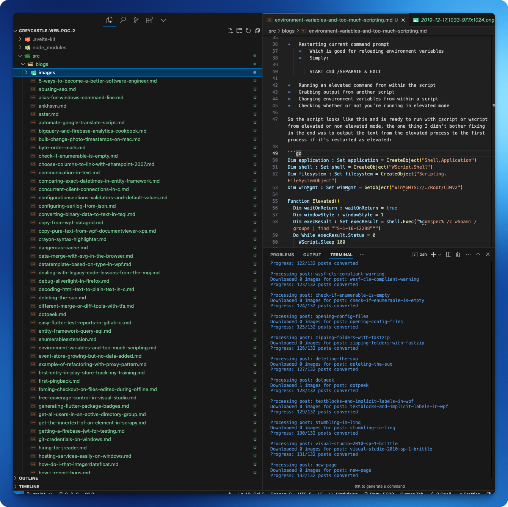

# WordPress to Markdown Exporter

A Node.js tool to export WordPress posts to Markdown files with YAML frontmatter, while preserving images and code blocks.

## Features

- Exports WordPress posts to individual Markdown files
- Preserves YAML frontmatter with post metadata (title, date, categories, tags, etc.)
- Downloads and saves images locally, updating references in the Markdown
- Intelligent code block handling with language detection
- Configurable post limit and output directory
- Supports custom code block class names

## Running it

I recommend using `npx` for simplicity.


```bash
npx wp-to-markdown \
  --url="https://example.com" \
  --username="admin" \
  --password="password" \
  --output="path/to/output" \
  --limit=10 \
  --code-block-class="EnlighterJSRAW"
```

### Parameters

- `url`: The URL of the WordPress site.
- `username`: The username for authentication.
- `password`: The password for authentication.
- `output`: The path to the output directory.
- `limit`: The maximum number of posts to export.
- `code-block-class`: The class name of the code block to use.

### Limiting

If you want to limit the number of posts exported, you can use the `--limit` parameter. This is useful if you want to test the tool or only export a subset of your posts.

### Code Block Class

If you want to use a custom code block class, you can use the `--code-block-class` parameter. This is useful if you want to use a specific syntax highlighter.

It's a bit basic and will try to guess the language based on the contents of the code block but it's not perfect, only better than nothing.


### Image download

Images are downloaded and saved locally, updating references in the Markdown.

## Example output


